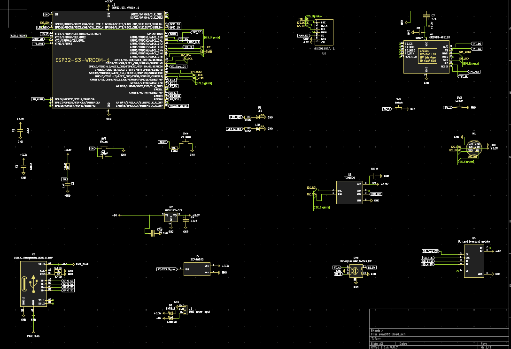
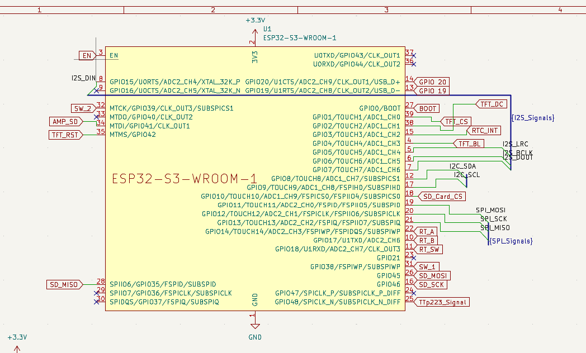
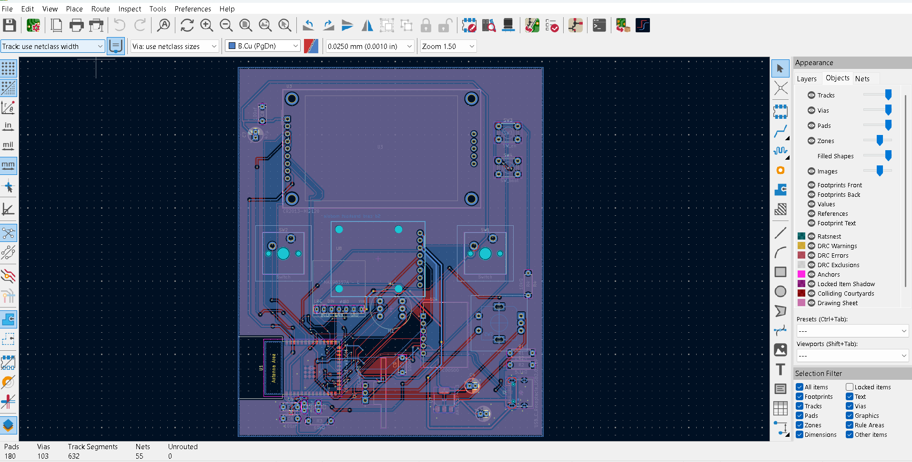
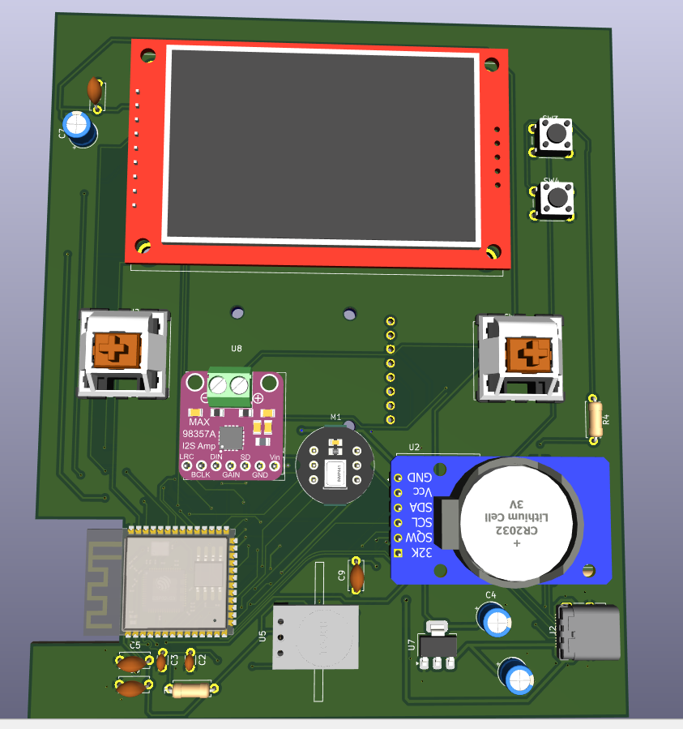
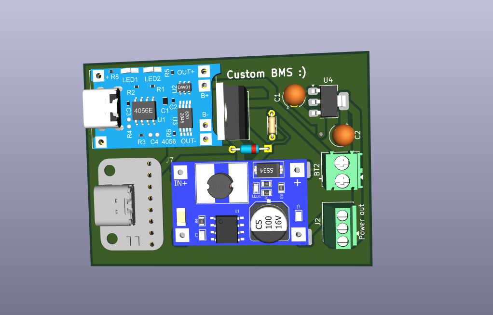
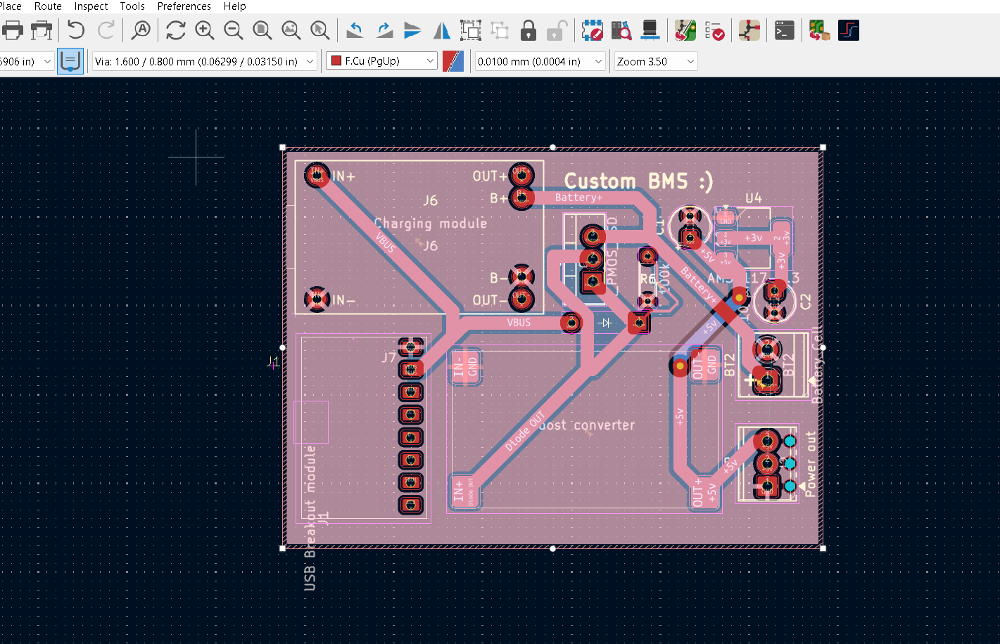
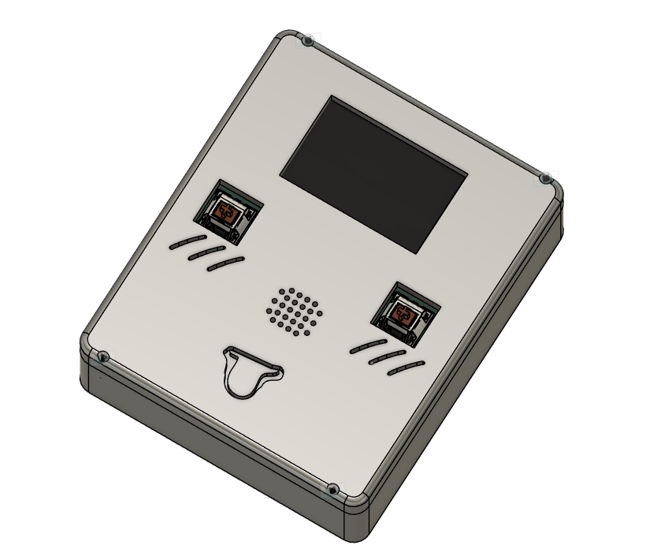
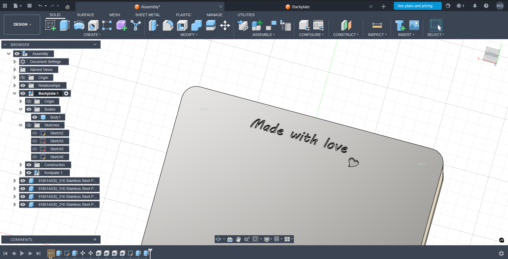
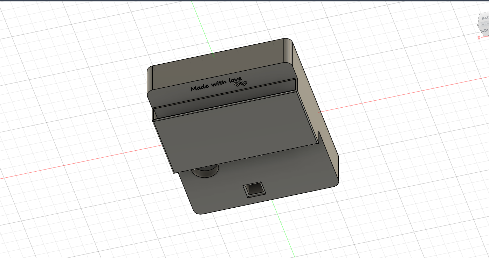

# Wacky and cute-( self claimed :} ) Music Player 

**Music Player v1** is a interactive  media device (media form: music, voice recording, text, gifs and video possibly) powered by an ESP32-S3.I designed it as a personalized gift,to play unique music, affirmations,  every single day onpre-programmed schedule. v2 will have an APi endpoint to post voice recordings over the internet and other cool features. The device is a complete package for audio related projects and can be modified into other creative ideas like - (voice journal keeper, online music streaming and many more!)

---

## Features

* **Daily Present:** Automatically fetches unique content (music and text(affiramtions/notes)) from an SD card based on the current date.
* **High-quality Audio:** Uses I2S protocol with a MAX98357A DAC for clear, non-blocking WAV file playback.
* **Voice Recorder:** Record and save voice memos directly to the SD card for future playback ** Plans to stream it over the internet
* **Music Player:** Plays music playlists from the sd card
* **Peculiar Cute design** Cute 3d model case enclosure with a tounge sticking out 😛

---

##  Hardware Design

### Schematic
The system integrates an ESP32-S3 with I2S audio, SPI SD card communication, and I2C/SPI display interfacing.

### PCB Design
A custom 2-layer PCB design from kicad.

### Power Board

### 3D Model for Case
A custom 3d model case from fusion 360

---
##  Bill of Materials (BOM)

| Component           | Description                                  | Quantity |
| :------------------ | :------------------------------------------- | :------- |
| **Microcontroller** | ESP32-S3 (WROOM-1-N16R8)                     | 1        |
| **Display** | 2.4" TFT LCD (ILI9341 Driver)                | 1        |
| **Audio DAC/Amp** | MAX98357A I2S Class D Amplifier              | 1        |
| **Speaker** | 3W 4-Ohm Internal Speaker                    | 1        |
| **Rotary Encoder** | EC11 Encoder with Push-Button Switch         | 1        |
| **Touch Sensor** | TTP223 Capacitive Touch Module (Soft Power)  | 1        |
| **SD card module** | Adafruit Micro SD Card Breakout Board      | 1        |
| **Microphone** | INMP441 I2S Digital Omnidirectional Mic      | 1        |
| **RTC Module** | DS3231 High-Precision I2C RTC                | 1        |
| **Storage Card** | 16GB Micro SD Card       | 1        |
| **BMS Board** | Custom made battery management system      | 1        |
---

##  Project Structure

* `firmware/pages`: Contains the class logic for each UI state (`Daily`, `Music`, `Record`, `History`).
* `main.py`: The primary async loop and state machine handler.
* `setup.py`: Hardware initialization and pin mapping.
* `master.json`: The central database for the daily gift schedule.

## File Structure:

* `/3d Model`: Contains fusion and 3d printing files for the case.
* `/firmware`: Contains the code
* `Kicad`: Kicad files (both power and main board)
       * `Power_kicad`: Custom made bms system kicad project
       * `main_kicad`: main pcb kicad project
* `/images`: For images of README.md
* `/BOM details`: For BOM from Kicad and my cost compiled for the enitre project
          *`project.csv`: For cost compiled BOM
* `Gerber Files`: For JLCPCB or any other manufacturer
          * `production_main`: Gerber for the main pcb
          * `production_power`: Gerber for the BMS pcb

---

# Why build this?
I built it becasue I really wanted to get into making a custom esp32 chip board and happened to stumble upon a music player gift idea. And from there I spiralled into making the best version of my idea. It plays a different song and displays unique affiramtions from a predefined library to bringten up someones day. OFC my handcrafted playlist library is the biggest treasure :). You can build your own too! For yourself or for someone else. Good Luck >> After you complete it, share it with me from the info at https://manishd.is-a.dev/ .

*Created with love❤️.*