# Wacky and cute- *self claimed :)* Music Player 

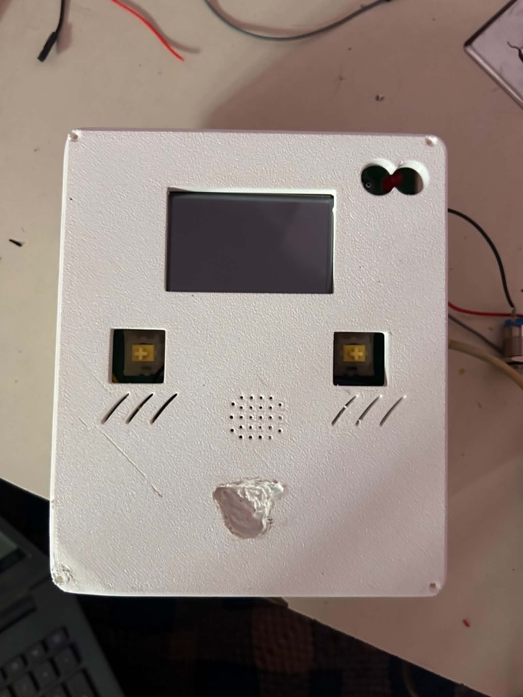

**Music Player v1** is a interactive  media device (media form: music, voice recording, text, gifs and video possibly) powered by an ESP32-S3.I designed it as a personalized gift,to play unique music, affirmations,  every single day onpre-programmed schedule. v2 will have an APi endpoint to post voice recordings over the internet and other cool features. The device is a complete package for audio related projects and can be modified into other creative ideas like - (voice journal keeper, online music streaming and many more!)

---

## Features

* **Daily Present:** Automatically fetches unique content (music and text(affiramtions/notes)) from an SD card based on the current date.
* **High-quality Audio:** Uses I2S protocol with a MAX98357A DAC for clear, non-blocking WAV file playback.
* **Voice Recorder:** Record and save voice memos directly to the SD card for future playback ** Plans to stream it over the internet
* **Music Player:** Plays music playlists from the sd card
* **Peculiar Cute design** Cute 3d model case enclosure with a tounge sticking out 😛

---

##  Hardware Design

### Schematic
The system integrates an ESP32-S3 with I2S audio, SPI SD card communication, and I2C/SPI display interfacing.

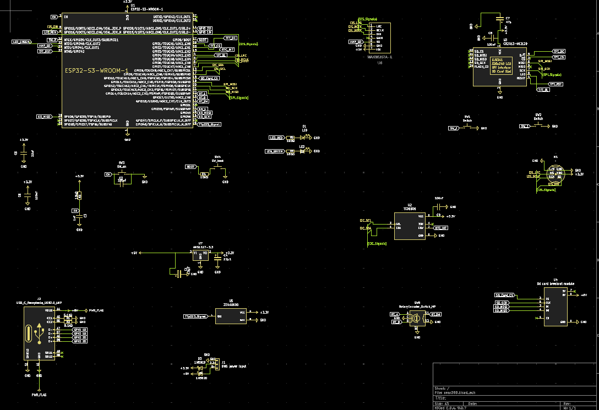
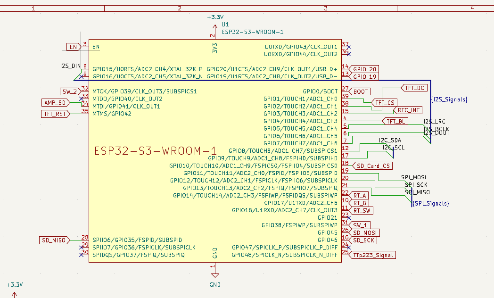

### PCB Design
A custom 2-layer PCB design from kicad.

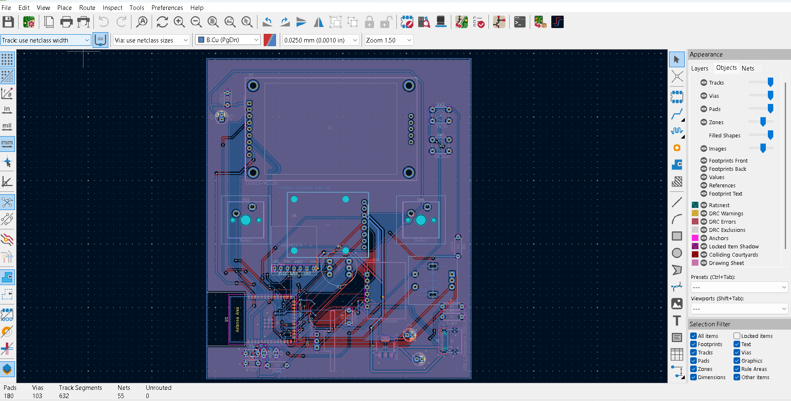
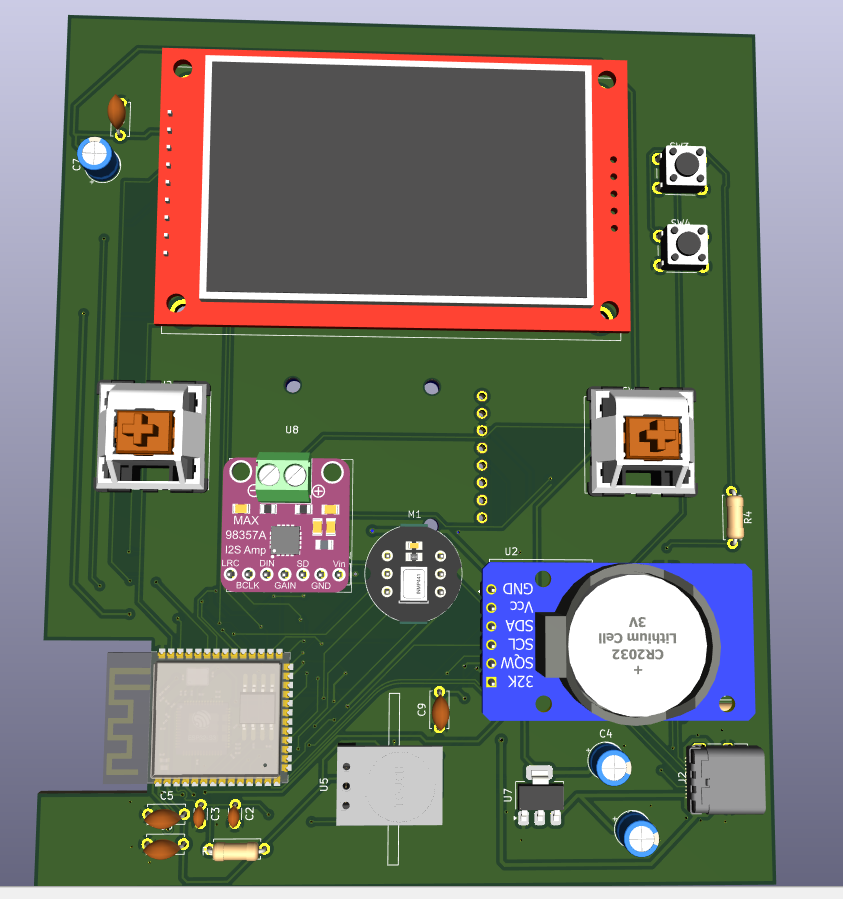

### Power Board
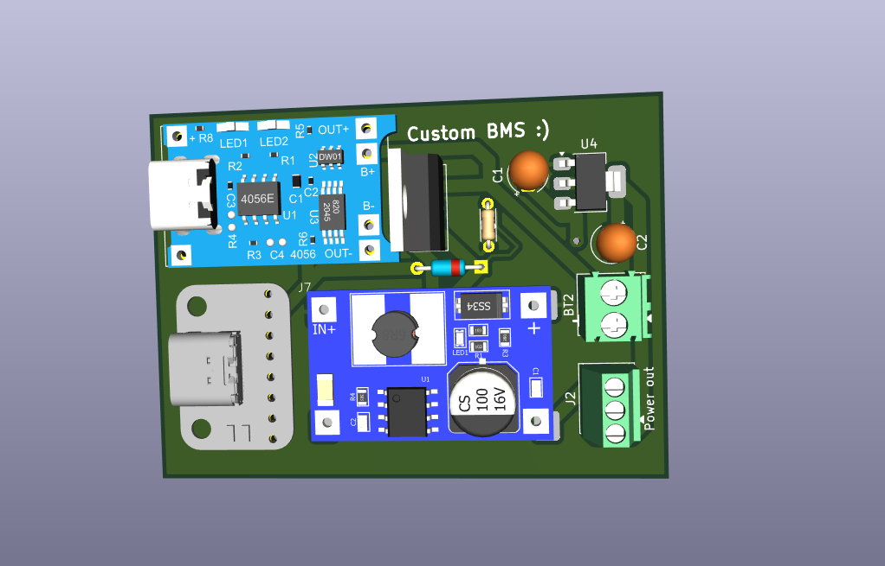
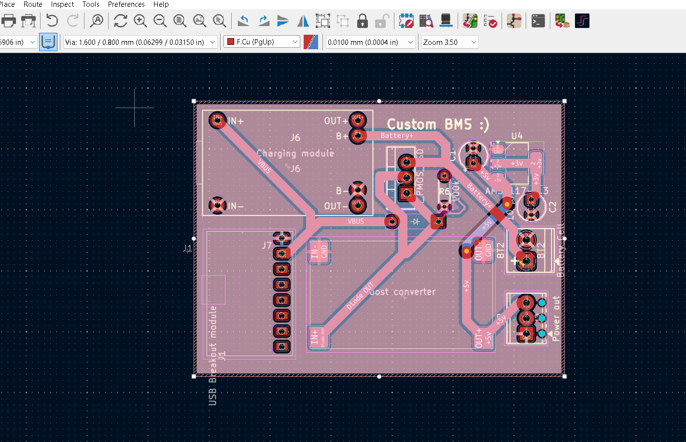
### 3D Model for Case
A custom 3d model case from fusion 360

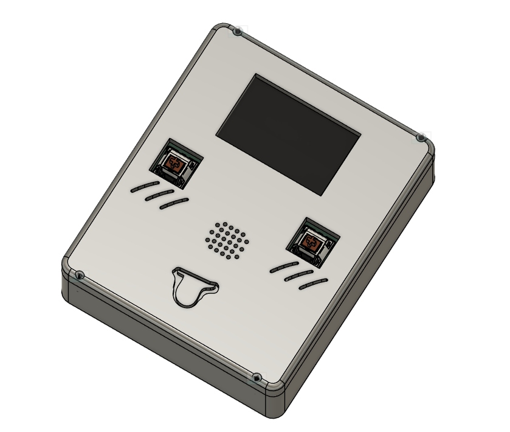
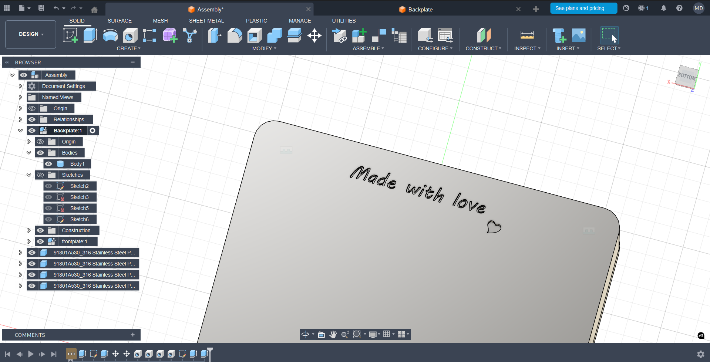
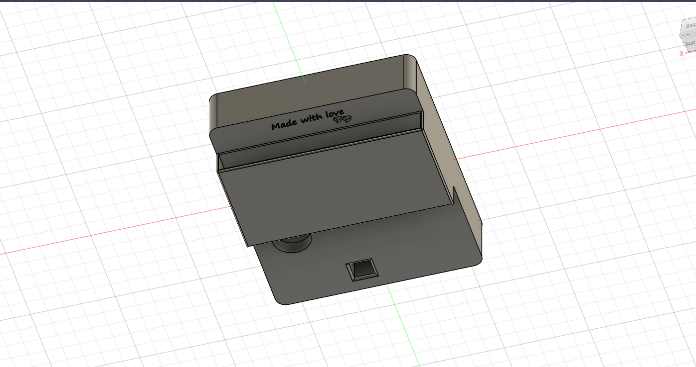
---
##  Bill of Materials (BOM)

| Component           | Description                                  | Quantity |
| :------------------ | :------------------------------------------- | :------- |
| **Microcontroller** | ESP32-S3 (WROOM-1-N16R8)                     | 1        |
| **Display** | 2.4" TFT LCD (ILI9341 Driver)                | 1        |
| **Audio DAC/Amp** | MAX98357A I2S Class D Amplifier              | 1        |
| **Speaker** | 3W 4-Ohm Internal Speaker                    | 1        |
| **Rotary Encoder** | EC11 Encoder with Push-Button Switch         | 1        |
| **Touch Sensor** | TTP223 Capacitive Touch Module (Soft Power)  | 1        |
| **SD card module** | Adafruit Micro SD Card Breakout Board      | 1        |
| **Microphone** | INMP441 I2S Digital Omnidirectional Mic      | 1        |
| **RTC Module** | DS3231 High-Precision I2C RTC                | 1        |
| **Storage Card** | 16GB Micro SD Card       | 1        |
| **BMS Board** | Custom made battery management system      | 1        |
> [!NOTE]
> This is just a summary of the BOM. The complete BOM can be found in [`/BOM details/project.csv`](BOM%20details/project.csv)
---

##  Project Structure

* `firmware/pages`: Contains the class logic for each UI state (`Daily`, `Music`, `Record`, `History`).
* `main.py`: The primary async loop and state machine handler.
* `setup.py`: Hardware initialization and pin mapping.
* `master.json`: The central database for the daily gift schedule.

## File Structure:

* `/3d Model`: Contains fusion and 3d printing files for the case.
* `/firmware`: Contains the code
* `Kicad`: Kicad files (both power and main board)
       * `Power_kicad`: Custom made bms system kicad project
       * `main_kicad`: main pcb kicad project
* `/images`: For images of README.md
* `/BOM details`: For BOM from Kicad and my cost compiled for the enitre project
          *`project.csv`: For cost compiled BOM
* `Gerber Files`: For JLCPCB or any other manufacturer
          * `production_main`: Gerber for the main pcb
          * `production_power`: Gerber for the BMS pcb

---

# Why build this?
I built it becasue I really wanted to get into making a custom esp32 chip board and happened to stumble upon a music player gift idea. And from there I spiralled into making the best version of my idea. It plays a different song and displays unique affiramtions from a predefined library to bringten up someones day. OFC my handcrafted playlist library is the biggest treasure :). You can build your own too! For yourself or for someone else. Good Luck >> After you complete it, share it with me from the info at https://manishd.is-a.dev/ .

# My build

### What Works Perfectly:
* **Playback:** Successfully fetches scheduled daily gifts/affirmations and plays audio
* **Network & Time Sync:** Connects to the internet to update and synchronize time data via API
* **Custom UI:** The custom LVGL-based TFT user interface turned out beautifully and performs well 

### Improvements that could better my build:
1. **The BMS Architecture:** Looking back, splitting the power/BMS circuit onto a separate board added unnecessary assembly complexity. For v2, the power management circuit will on a singl PCB.
2. **I2S Audio Recording:** While standalone microphone test scripts work flawlessly, fully integrating the voice-recording firmware into the main async package remains a work-in-progress becasue of some pin conflict
3. **Prototyping Materials Matter:** Using standard breadboard jumper wires and low-quality solder wire made internal routing extremely messy and prone to weak joints and gave me a veryvery hard time during building. This also made the final result messy and prone to breaking down/short ciruit.
4. **Hardware Casualty:** During the final hardware assembly stages, the TFT display took some physical damage which was just devestating. But it works kinda alright so fine i guess.

<b> This is the tft after damage</b>

 

  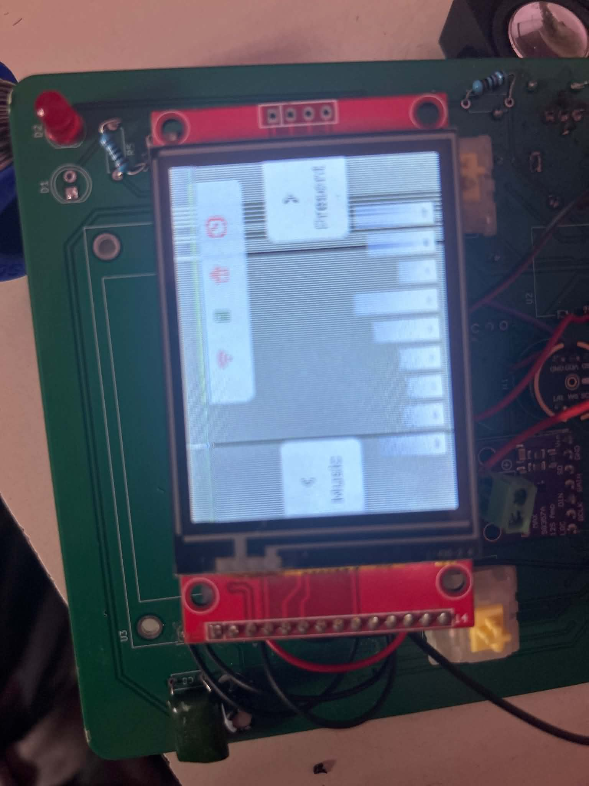
   
  It works though so its fine guess.

---
> 💡 **Note:** This video was recorded during early testing. Some UI components shown in the gallery below are not visible in the clip. use the static images for final UI reference.

#### From the outside
<table width="100%">
  <tr>
    <td width="50%" align="center">
      
       
      <b>Enclosure Assembly</b>
    </td>
    <td width="50%" align="center">
      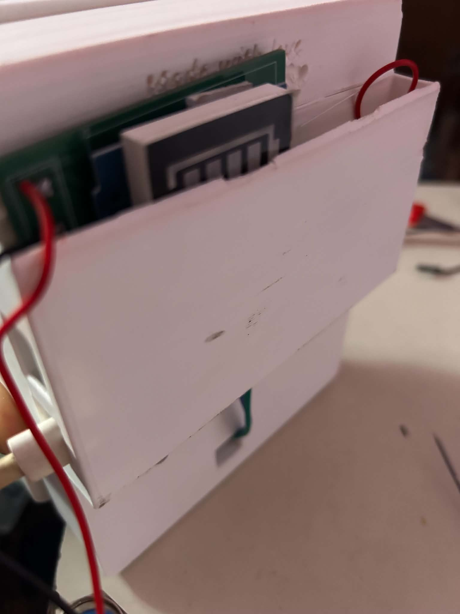
       
      <b>Wacky Cute Tongue Profile 😛</b>
    </td>
  </tr>
</table>

#### UI
<table width="100%">
  <tr>
    <td width="33%" align="center">
      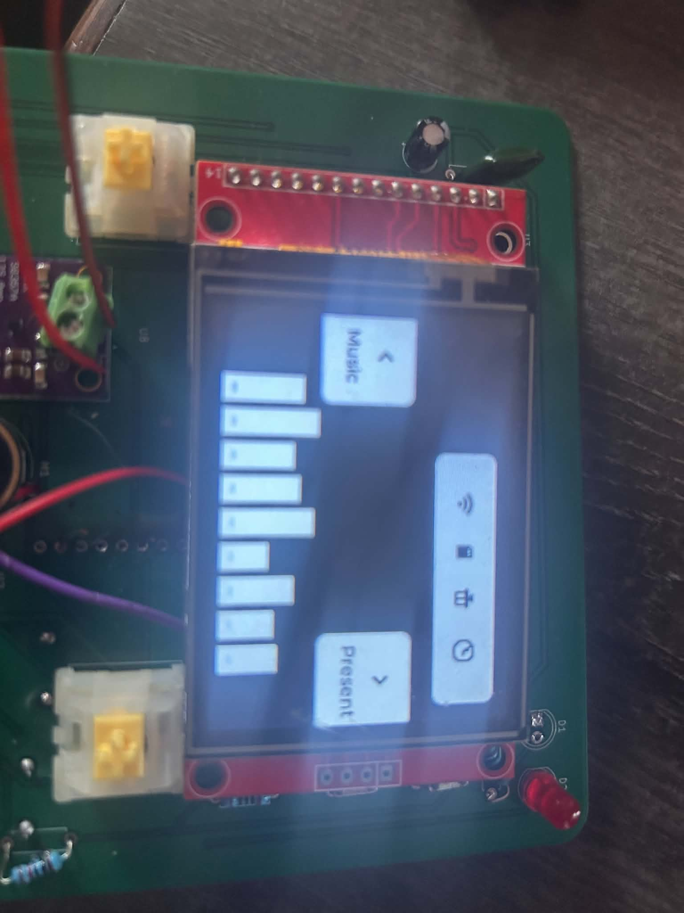
       
      <b>Home</b>
    </td>
    <td width="33%" align="center">
      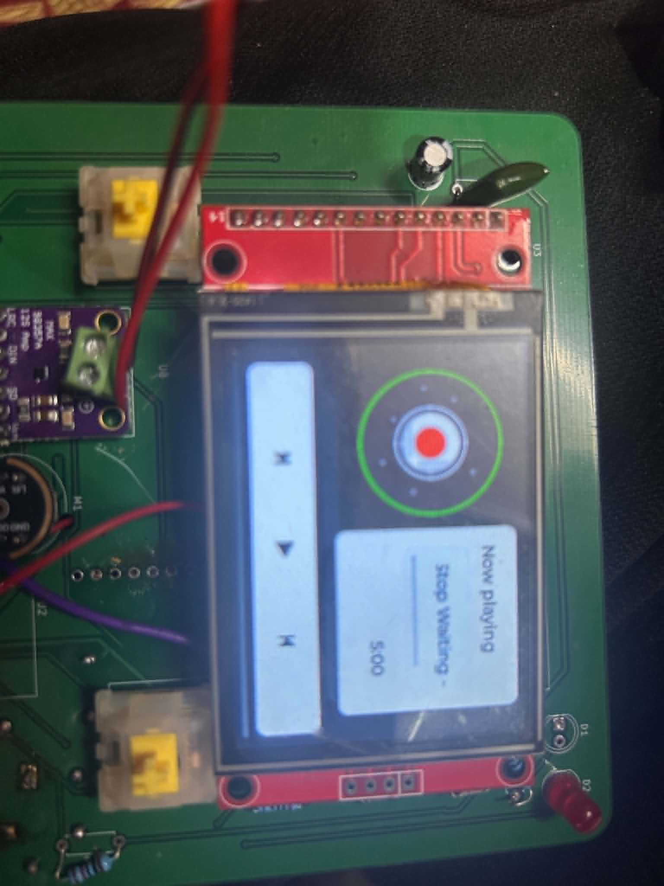
       
      <b>Music Screen</b>
    </td>
    <td width="33%" align="center">
      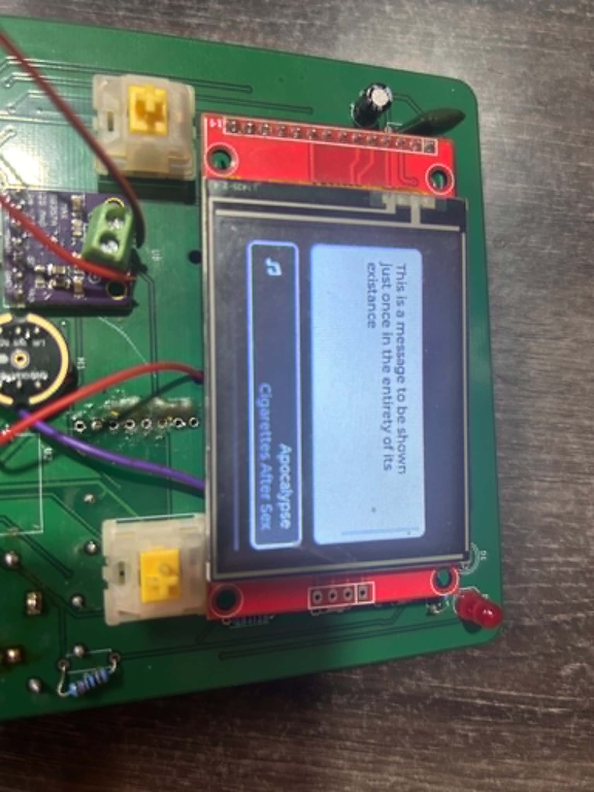
       
      <b>Gift screen</b>
    </td>
  </tr>
</table>

## AI USE:
I used AI heavily for the coding part. Around 40%-50%. Majority of the project is hardware based so AI use for the whole project is less than 25%. The things I used AI for - 

- Help with KICAD DRC issue
- Help with hole configuration on Fusion 360
- Troubleshooting design elements
- LVGL library and firmware setup (first time using it so thats why)
- LVGL library functions
- Acurate Encoder Input 

And a lot of debugging stuff.

*Created with love❤️.*